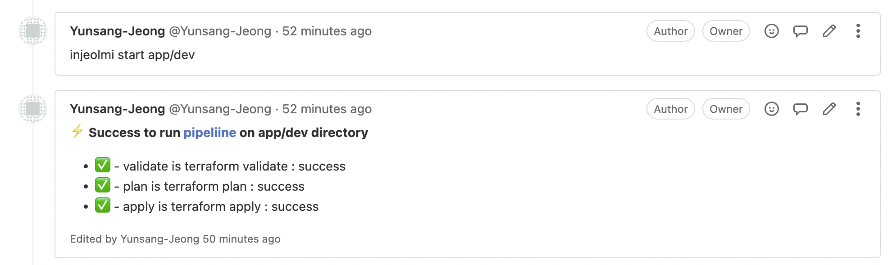
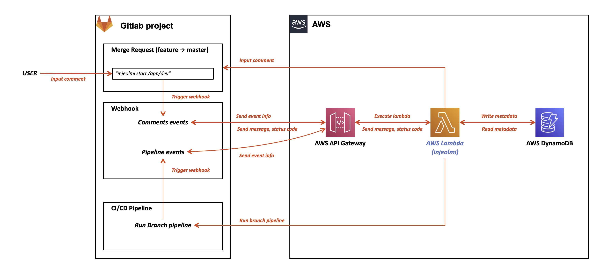

# What is Injeolmi?

Injeolmi is AWS Lambda function for running terraform task through Gitlab CI/CD Pipeline. 

It is very inspired by [atlantis](https://github.com/runatlantis/atlantis). The difference is that the terraform-cli is performed on the Gitlab-Pipeline.



## Service architecture

A series of AWS resources for deploying **injeolmi** can be build with terraform in `/infra`.



## App architecture

App is running on AWS Lambda. It works as follows
 - Parse info from the webhook-events.
 - Load `gitlab-token` from env(`GITLAB_TOKEN`) and `webhook-secret` from env(`GITLAB_WEBHOOK_SECRET`).
 - Validate webbhook-secret.
 - Analyze comments and run the action according to the result.

# How to use

1. generate `gitlab-token` and random string for `webhook-secret`.

2. Add `.gitlab-ci.yml` in your gitlab project.

```yaml
variables:
  CHDIR: "%NEED_TO_INPUT%"

workflow:
  rules:
    - if: $CHDIR == "%NEED_TO_INPUT%"
      when: never
    - if: $CI_PIPELINE_SOURCE == "api" || $CI_PIPELINE_SOURCE == "web"
      when: always

image:
  name: hashicorp/terraform:light
  entrypoint:
    - '/usr/bin/env'
    - 'PATH=/usr/local/sbin:/usr/local/bin:/usr/sbin:/usr/bin:/sbin:/bin'

stages:
  - plan
  - apply

terraform plan:
  stage: plan
  script:
    - cd $CHDIR
    - terraform init 
    - terraform plan -out "planfile"
  artifacts:
    paths:
      - $CHDIR/planfile

terraform apply:
  stage: apply
  script:
    - cd $CHDIR
    - terraform init
    - terraform apply "planfile"
  when: manual
  dependencies:
    - terraform plan
```

3. Deploy AWS resource 

```bash
$ ./loca-build.sh
$ cd ./infra
$ terraform init 
$ terraform plan -out "plan" # <-- need to input gitlab_token, webhook_secret
$ terraform apply "plan"
```

4. Setup gitlab webhook (Settings > Webhooks)

 - In `URL`, input `apigateway_invoke_url` value from terraform output.
 - In `Secret token`, input`webhook-secret` value.
 - In `Trigger`, check `Comments`.
 - Run test